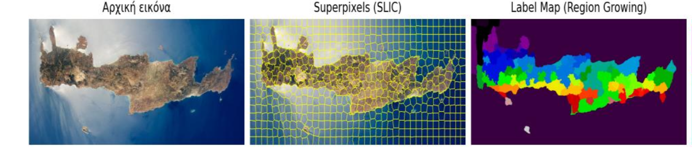
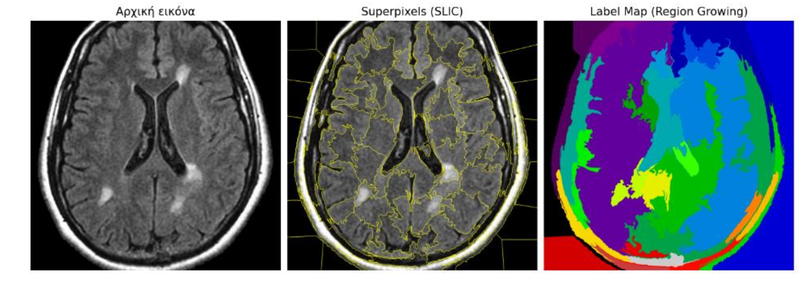
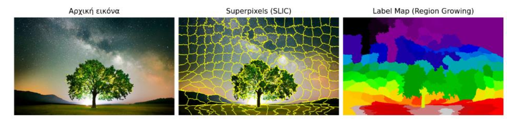

# Hybrid Image Segmentation with Superpixels and Region Growing

This project implements a hybrid image segmentation method that combines **SLIC superpixels** with **region growing**.  
It was developed as a **team project** for the university course *Digital Image Processing* at the University of Thessaly.

---

## Description

The algorithm works in two main stages:

1. **SLIC Superpixels** – the image is oversegmented into compact, visually meaningful regions.
2. **Region Growing** – neighboring superpixels are merged based on their color similarity (in LAB color space).

The combined approach improves segmentation quality and produces smoother, more accurate region boundaries.

---

## Files

- `FinalProject2025.py` → Main Python script
- `cherry.jpg` → Default input image (you can replace this with your own)
- `requirements.txt` → Python dependencies

---

## How to Run

1. Make sure you have Python 3 and install the required packages:

```bash
pip install numpy opencv-python scikit-image matplotlib
```

2. Run the script:

```bash
python FinalProject2025.py
```

> The script will use `cherry.jpg` by default. You can replace it with your own image by editing the file path inside the script.

---

## Example Output

### Input Image


### Example 1 – Segmentation of satellite image


### Example 2 – MRI scan segmentation


### Example 3 – Natural image segmentation


---


---

## License

This project was developed for academic purposes only.
